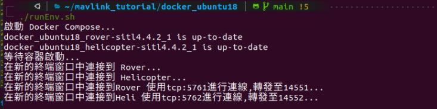
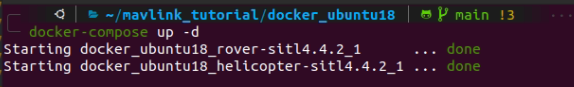

## MAVLink Simulator Docker 環境
### 項目描述
這個項目包含了用於模擬MAVLink通信的Docker容器和Bash腳本。容器包括了設置用於無人機（Helicopter）和地面車輛（Rover）的模擬器，而Bash腳本則用於啟動和管理這些容器。
只需要透過腳本即可自動建立測試環境。



### 安裝指南
要運行此項目，您需要安裝Docker和Docker Compose。這些可以在官方網站找到相應的安裝指南。

#### Docker 安裝
請訪問 Docker 官方網站 並根據您的操作系統進行安裝。
以下提供參考，具體採官方文件為主：
```
sudo apt install docker
```

#### Docker Compose 安裝
安裝Docker後，您可以按照 Docker Compose 安裝指南 安裝Docker Compose。
以下提供參考，具體採官方文件為主：
```
sudo apt install docker-compse
```
### 配置
在運行容器之前，確保您的docker-compose.yml文件和Dockerfile放置於相同的目錄下。

### 腳本運行指南
使用以下步驟來啟動模擬器：
```
#!/bin/bash

# 啟動 Docker Compose
echo "啟動 Docker Compose..."
docker-compose up -d

# 確保容器有足夠的時間啟動
echo "等待容器啟動..."
sleep 10


# 在新的終端窗口中啟動 MAVProxy 連接到 Rover
echo "在新的終端窗口中連接到 Rover..."
gnome-terminal -- bash -c "mavproxy.py --master=tcp:127.0.0.1:5761 \
 --out=udp:127.0.0.1:14551 \
 --map \
 --console; exec bash"
sleep 1

# 在另一個新的終端窗口中啟動 MAVProxy 連接到 Helicopter
echo "在新的終端窗口中連接到 Helicopter..."
gnome-terminal -- bash -c "mavproxy.py --master=tcp:127.0.0.1:5762 \
 --out=udp:127.0.0.1:14552 \
 --map \
 --console; exec bash"
sleep 1
echo "在新的終端窗口中連接到Rover 使用tcp:5761進行連線,轉發至14551..."

echo "在新的終端窗口中連接到Heli 使用tcp:5762進行連線,轉發至14552..."

```
確保腳本具有執行權限，如有需要，可以使用chmod +x your_script.sh命令。
### 使用說明
#### Docker容器：
rover-sitl4.4.2和helicopter-sitl4.4.2是兩個分別模擬Rover和Helicopter的容器。
容器使用5761和5762端口分別暴露Rover和Helicopter的MAVLink接口。
#### Bash腳本：
腳本首先啟動Docker容器。
然後在不同的終端窗口中啟動MAVProxy，以連接到Rover和Helicopter。
### 注意事項
確保在運行Bash腳本之前，Docker服務已啟動。
根據您的系統配置和需求，您可能需要調整Docker和MAVProxy的配置。