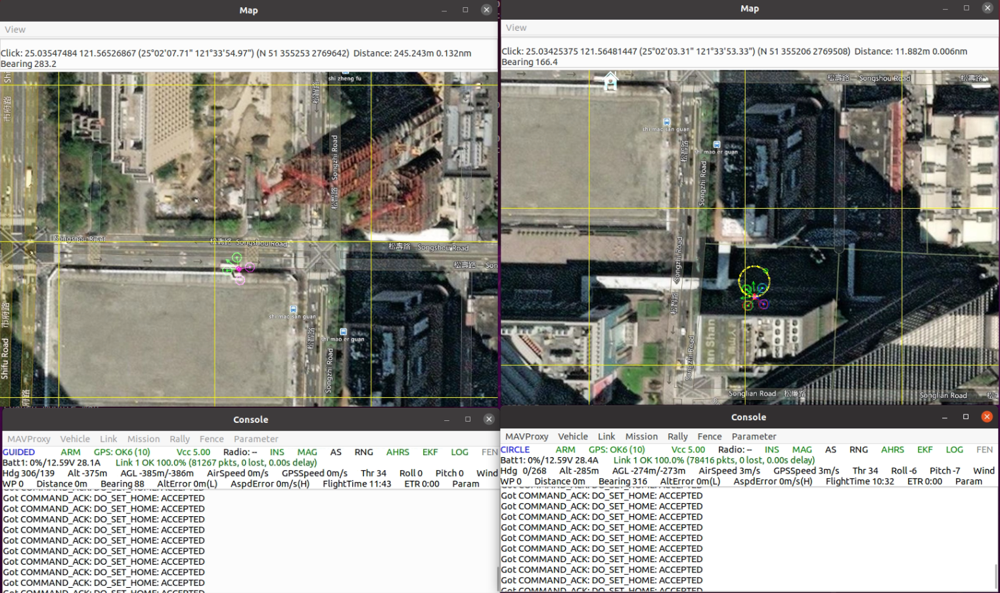
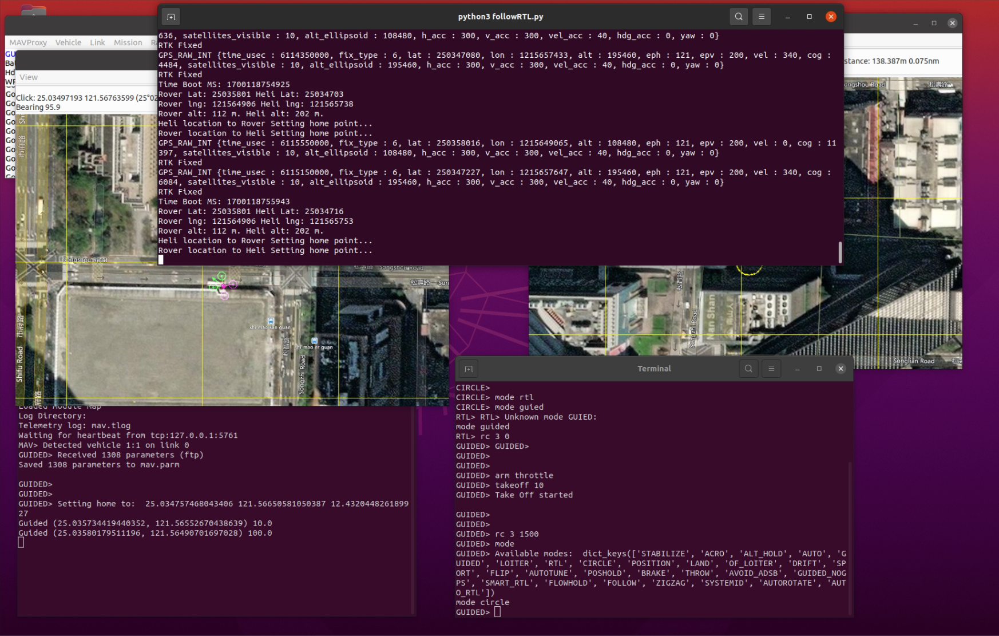

## MAVLink連接和控制腳本
### 簡介
這個腳本提供了一種方法，用於通過MAVLink協議同時與無人機（heli）和地面車輛（rover）建立通信連接。腳本中包含了建立連接、獲取GPS數據、設置家庭點以及一些基本的無人機控制指令。



****
### SITL環境建制
可以參考下面文件，以完成Docker自動化建置，與mavlink多運行腳本。
<https://github.com/Oliver0804/mavlink_tutorial/tree/main/docker_ubuntu18#readme>

****
### 安裝指南

要運行這個腳本，您需要安裝pymavlink庫。這可以通過以下命令完成：
```
pip install pymavlink
```

### 配置

腳本使用一個名為config.json的JSON文件來讀取連接參數。這個文件應包含無人機和地面車輛的連接信息，例如：

```

{
  "heli": {
    "type": "udp",
    "address": "127.0.0.1",
    "port": 14551
  },
  "rover": {
    "type": "udp",
    "address": "127.0.0.1",
    "port": 14552
  }
}
```
請根據您的設備配置調整這些參數。

運行本地數傳模塊
```
mavproxy.py --master=/dev/ttyACM1 --baudrate=115200 --out=udp:127.0.0.1:14577 --map --console
```

### 使用方法

確保您的無人機和地面車輛已經開機並且可以通過MAVLink連接。
確保config.json文件包含正確的連接信息。
在腳本所在的目錄下運行腳本：
```
python3 followRTL.py
```

### 功能

1. 自動從config.json文件中讀取連接參數。
2. 與無人機和地面車輛建立UDP連接。
3. 獲取和顯示GPS數據。
4. 設置無人機和地面車輛的家庭點。

****

### 注意事項

確保無人機和地面車輛在開始之前已經準備就緒。
本腳本僅作為範例，可能需要根據您的具體需求進行調整。
